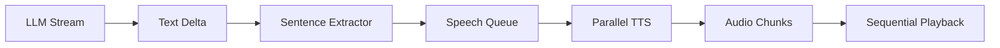

## Overview

Streaming speech synthesis splits LLM-generated text into **sentence-sized chunks** and converts them to audio **in parallel** as the text streams in. This dramatically reduces time-to-first-audio compared to waiting for the full response.

## Why Streaming Speech?

<CardGroup cols={2}>
  <Card title="Low Latency" icon="gauge-high">
    First audio plays in ~1-2 seconds instead of 10-30 seconds
  </Card>
  
  <Card title="Natural Flow" icon="water">
    Audio starts speaking before LLM finishes generating
  </Card>
  
  <Card title="Parallel TTS" icon="layer-group">
    Multiple chunks generate audio simultaneously
  </Card>
  
  <Card title="Interruptible" icon="stop">
    Barge-in cancels pending chunks instantly
  </Card>
</CardGroup>

## How It Works

The `SpeechManager` processes text deltas from `streamText()` in real-time:



### Processing Flow

1. **Text delta arrives** from LLM (e.g., "Hello! How")
2. **Buffer accumulates** text until sentence boundary found
3. **Sentence extracted** when `.` `!` `?` detected (e.g., "Hello!")
4. **Chunk queued** for TTS generation
5. **Parallel generation** starts immediately (up to `maxParallelRequests`)
6. **Audio ready** - chunk sent to client via WebSocket
7. **Sequential playback** - client plays chunks in order
8. **Repeat** for next sentence

## Configuration

### StreamingSpeechConfig

```ts
interface StreamingSpeechConfig {
  /** Minimum characters before generating speech for a chunk */
  minChunkSize: number;
  
  /** Maximum characters per chunk (will split at sentence boundary before this) */
  maxChunkSize: number;
  
  /** Whether to enable parallel TTS generation */
  parallelGeneration: boolean;
  
  /** Maximum number of parallel TTS requests */
  maxParallelRequests: number;
}
```

### Default Configuration

```ts
const DEFAULT_STREAMING_SPEECH_CONFIG = {
  minChunkSize: 50,
  maxChunkSize: 200,
  parallelGeneration: true,
  maxParallelRequests: 3,
};
```

### Customizing

```ts
import { VoiceAgent } from 'voice-agent-ai-sdk';
import { openai } from '@ai-sdk/openai';

const agent = new VoiceAgent({
  model: openai('gpt-4o'),
  speechModel: openai.speech('gpt-4o-mini-tts'),
  
  streamingSpeech: {
    minChunkSize: 40,    // Start TTS after 40 chars (faster, more chunks)
    maxChunkSize: 180,   // Force split at 180 chars (smaller chunks)
    parallelGeneration: true,
    maxParallelRequests: 2,  // Limit concurrent TTS requests
  },
});
```

## Sentence Boundary Detection

The `SpeechManager` extracts sentences using pattern matching:

```ts
// Match sentences ending with . ! ? followed by space or end of string
const sentenceEndPattern = /[.!?]+(?:\s+|$)/g;
```

### Examples

| Text Buffer | Extracted | Remaining |
|------------|-----------|----------|
| `"Hello! How are you"` | `"Hello!"` | `"How are you"` |
| `"I'm fine. Thanks!"` | `"I'm fine."` | `"Thanks!"` |
| `"Wait..."` | `"Wait..."` | `""` |
| `"Almost there"` | `[]` | `"Almost there"` (no boundary yet) |

### Minimum Chunk Size

Sentences shorter than `minChunkSize` are **appended to the previous chunk**:

```ts
if (sentence.length >= this.streamingSpeechConfig.minChunkSize) {
  sentences.push(sentence);
} else if (sentences.length > 0) {
  // Append to previous sentence
  sentences[sentences.length - 1] += ' ' + sentence;
}
```

This prevents generating TTS for very short fragments like `"Yes."` or `"Ok!"`.

## Clause Splitting (Fallback)

If remaining text exceeds `maxChunkSize` without a sentence boundary, the manager **force-splits at clause boundaries** (`,` `;` `:`):

```ts
if (remaining.length > this.streamingSpeechConfig.maxChunkSize) {
  const clausePattern = /[,;:]\s+/g;
  // Find first clause boundary after minChunkSize
  // Split there to avoid excessively long chunks
}
```

**Example:**

```
Input: "The quick brown fox jumps over the lazy dog, and then it runs through the forest, chasing a rabbit, until it reaches the river"

maxChunkSize = 100

Chunks:
1. "The quick brown fox jumps over the lazy dog,"
2. "and then it runs through the forest,"
3. "chasing a rabbit, until it reaches the river"
```

## Parallel TTS Generation

When `parallelGeneration` is enabled, the manager starts generating audio for upcoming chunks while the current chunk plays:

```ts
// Start generating next chunks in parallel
if (this.streamingSpeechConfig.parallelGeneration) {
  const activeRequests = this.speechChunkQueue.filter(
    (c) => c.audioPromise
  ).length;
  
  const toStart = Math.min(
    this.streamingSpeechConfig.maxParallelRequests - activeRequests,
    this.speechChunkQueue.length
  );

  if (toStart > 0) {
    for (let i = 0; i < toStart; i++) {
      const nextChunk = this.speechChunkQueue.find(c => !c.audioPromise);
      if (nextChunk) {
        nextChunk.audioPromise = this.generateChunkAudio(nextChunk);
      }
    }
  }
}
```

### Benefits

- **Reduced wait time** between chunks (audio ready when previous finishes)
- **Better throughput** for long responses
- **Configurable concurrency** to control API rate limits

### Limits

`maxParallelRequests` controls how many TTS requests run concurrently:

- **Too low** (1): No parallelism, chunks generate sequentially
- **Optimal** (2-3): Good balance of speed and API usage
- **Too high** (5+): May hit rate limits, no significant gain

## Speech Queue

Chunks are queued and processed in order:

```ts
interface SpeechChunk {
  id: number;              // Sequential chunk ID
  text: string;            // Text to convert to speech
  audioPromise?: Promise<Uint8Array | null>;  // TTS generation promise
}

private speechChunkQueue: SpeechChunk[] = [];
private nextChunkId = 0;
```

### Queue Processing

```ts
while (this.speechChunkQueue.length > 0) {
  const chunk = this.speechChunkQueue[0];

  // Ensure audio generation has started
  if (!chunk.audioPromise) {
    chunk.audioPromise = this.generateChunkAudio(chunk);
  }

  // Wait for this chunk's audio
  const audioData = await chunk.audioPromise;

  // Check if interrupted while waiting
  if (!this._isSpeaking) break;

  // Send chunk to client
  this.sendMessage({
    type: 'audio_chunk',
    chunkId: chunk.id,
    data: base64Audio,
    format: this.outputFormat,
    text: chunk.text,
  });

  // Remove from queue
  this.speechChunkQueue.shift();

  // Start generating next chunks in parallel
  // ...
}
```

## Events

<ResponseField name="speech_chunk_queued" type="object">
  A text chunk was queued for TTS generation
  ```ts
  {
    id: number;    // Chunk ID
    text: string;  // Chunk text
  }
  ```
</ResponseField>

<ResponseField name="audio_chunk" type="object">
  TTS audio for a chunk is ready
  ```ts
  {
    chunkId: number;       // Matches speech_chunk_queued id
    data: string;          // Base64-encoded audio
    format: string;        // 'mp3', 'opus', 'wav', etc.
    text: string;          // Original chunk text
    uint8Array: Uint8Array;  // Raw audio bytes
  }
  ```
</ResponseField>

<ResponseField name="speech_start" type="object">
  TTS generation started
  ```ts
  {
    streaming: boolean;  // true for chunked, false for full text
  }
  ```
</ResponseField>

<ResponseField name="speech_complete" type="object">
  All TTS chunks sent
  ```ts
  {
    streaming: boolean;
  }
  ```
</ResponseField>

<ResponseField name="speech_interrupted" type="object">
  Speech generation cancelled (barge-in)
  ```ts
  {
    reason: string;  // 'user_speaking', 'interrupted', etc.
  }
  ```
</ResponseField>

## Interruption Support

The agent can interrupt ongoing speech generation:

```ts
// Interrupt speech only (LLM keeps running)
agent.interruptSpeech('user_speaking');

// Interrupt both LLM stream and speech (full barge-in)
agent.interruptCurrentResponse('user_speaking');
```

### What Happens on Interrupt

1. **Abort controller** cancels all pending TTS requests
2. **Speech queue** is cleared
3. **Pending text buffer** is emptied
4. **Client receives** `speech_interrupted` message
5. **Client stops** playing audio immediately

```ts
interruptSpeech(reason: string = 'interrupted'): void {
  // Abort pending TTS generation
  if (this.currentSpeechAbortController) {
    this.currentSpeechAbortController.abort();
  }

  // Clear queue and state
  this.speechChunkQueue = [];
  this.pendingTextBuffer = '';
  this._isSpeaking = false;

  // Notify client
  this.sendMessage({
    type: 'speech_interrupted',
    reason,
  });
}
```

## Non-Streaming Fallback

For full-text TTS (non-chunked):

```ts
await agent.generateAndSendSpeechFull('Complete response text here.');
```

This generates audio for the entire text at once (higher latency, simpler).

## Example: Listening to Speech Events

```ts
import { VoiceAgent } from 'voice-agent-ai-sdk';
import { openai } from '@ai-sdk/openai';
import fs from 'fs';

const agent = new VoiceAgent({
  model: openai('gpt-4o'),
  speechModel: openai.speech('gpt-4o-mini-tts'),
  streamingSpeech: {
    minChunkSize: 40,
    maxChunkSize: 180,
    parallelGeneration: true,
    maxParallelRequests: 2,
  },
});

// Track chunk generation
let chunkCount = 0;
agent.on('speech_chunk_queued', ({ id, text }) => {
  console.log(`Chunk #${id} queued: "${text.substring(0, 50)}..."`);
  chunkCount++;
});

// Save audio chunks to files
agent.on('audio_chunk', ({ chunkId, uint8Array, format }) => {
  fs.writeFileSync(`chunk_${chunkId}.${format}`, uint8Array);
  console.log(`Chunk #${chunkId} saved (${uint8Array.length} bytes)`);
});

agent.on('speech_complete', () => {
  console.log(`Speech complete! Generated ${chunkCount} chunks.`);
});

// Test it
await agent.sendText('Tell me a story about a robot learning to paint.');
```

## Performance Tuning

### For Lower Latency

```ts
streamingSpeech: {
  minChunkSize: 30,    // Start TTS sooner
  maxChunkSize: 150,   // Smaller chunks
  parallelGeneration: true,
  maxParallelRequests: 3,  // More parallelism
}
```

**Trade-offs:**
- More API requests (higher cost)
- More network messages
- Potentially choppy if chunks too small

### For Lower Cost

```ts
streamingSpeech: {
  minChunkSize: 80,    // Larger chunks
  maxChunkSize: 300,
  parallelGeneration: true,
  maxParallelRequests: 1,  // Sequential generation
}
```

**Trade-offs:**
- Higher latency between chunks
- Fewer API requests
- Less responsive to interruption

### For Voice Quality

```ts
streamingSpeech: {
  minChunkSize: 60,
  maxChunkSize: 200,   // ~1-2 sentences per chunk
  parallelGeneration: true,
  maxParallelRequests: 2,
}
```

Balances natural pacing with responsiveness.

## Limitations

<Warning>
**Sentence detection is heuristic-based** and may split incorrectly on:
- Abbreviations ("Dr. Smith")
- Decimals ("3.14")
- Ellipses ("Wait...maybe")

For most conversational use cases, this is acceptable.
</Warning>

<Info>
**Parallel generation requires AbortSignal support** in your TTS provider. The AI SDK's `experimental_generateSpeech` supports this via `abortSignal`.
</Info>

## Best Practices

<AccordionGroup>
  <Accordion title="Start with defaults">
    The default configuration works well for most use cases:
    ```ts
    streamingSpeech: {
      minChunkSize: 50,
      maxChunkSize: 200,
      parallelGeneration: true,
      maxParallelRequests: 3,
    }
    ```
  </Accordion>

  <Accordion title="Monitor chunk counts">
    Log `speech_chunk_queued` events to see how many chunks are generated:
    ```ts
    agent.on('speech_chunk_queued', ({ id }) => {
      console.log(`Chunk #${id} queued`);
    });
    ```
    
    If you see too many chunks (>10 for a typical response), increase `minChunkSize`.
  </Accordion>

  <Accordion title="Handle interruptions">
    Always support barge-in for better UX:
    ```ts
    agent.on('speech_interrupted', ({ reason }) => {
      console.log(`Speech interrupted: ${reason}`);
    });
    ```
  </Accordion>

  <Accordion title="Test with real content">
    Different LLMs have different output styles. Test with your actual prompts to tune chunk sizes.
  </Accordion>
</AccordionGroup>

## Next Steps

<CardGroup cols={2}>
  <Card title="VoiceAgent" icon="microphone" href="/concepts/voice-agent">
    Learn about the voice agent architecture
  </Card>
  
  <Card title="Memory Management" icon="database" href="/concepts/memory-management">
    Configure conversation history limits
  </Card>
  
  <Card title="WebSocket Protocol" icon="plug" href="/concepts/websocket-protocol">
    Explore speech message types
  </Card>
  
  <Card title="API Reference" icon="code" href="/api/voice-agent">
    Full VoiceAgent API documentation
  </Card>
</CardGroup>