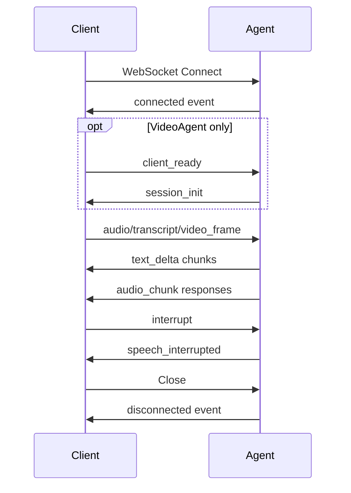

## Overview

The Voice Agent SDK uses WebSocket for bidirectional real-time communication between clients and agents. The protocol supports:

- Audio/video frame transmission
- Text transcripts
- Streaming text responses
- Speech audio chunks
- Tool execution events
- Lifecycle management

## Connection Lifecycle



## Message Format

All messages are JSON objects with a `type` field:

```ts
interface BaseMessage {
  type: string;
  [key: string]: any;
}
```

## Client → Agent Messages

### transcript

Send transcribed text from speech-to-text (bypasses agent transcription).

```ts
{
  type: 'transcript',
  text: string,  // User speech text
}
```

**Example:**

```ts
webSocket.send(JSON.stringify({
  type: 'transcript',
  text: 'What is the weather in San Francisco?',
}));
```

**Agent behavior:**
- Interrupts current LLM stream and speech
- Queues text input for processing
- (VideoAgent only) Requests frame capture

---

### audio

Send audio data for transcription by the agent.

```ts
{
  type: 'audio',
  data: string,      // Base64-encoded audio
  format?: string,   // Audio format (e.g., 'webm', 'mp3')
}
```

**Example:**

```ts
// Record audio from microphone
const audioBlob = await mediaRecorder.stop();
const base64Audio = await blobToBase64(audioBlob);

webSocket.send(JSON.stringify({
  type: 'audio',
  data: base64Audio,
  format: 'webm',
}));
```

**Agent behavior:**
- Interrupts current response
- Transcribes audio using `transcriptionModel`
- Emits `transcription` event
- Queues transcribed text for processing
- (VideoAgent only) Requests frame capture

---

### video_frame

(VideoAgent only) Send a video frame for vision analysis.

```ts
{
  type: 'video_frame',
  sessionId: string,
  sequence: number,
  timestamp: number,
  triggerReason: 'scene_change' | 'user_request' | 'timer' | 'initial',
  previousFrameRef?: string,
  image: {
    data: string,    // Base64-encoded image
    format: string,  // 'webp', 'jpeg', 'png'
    width: number,
    height: number,
  },
}
```

**Example:**

```ts
const canvas = document.createElement('canvas');
const ctx = canvas.getContext('2d');
canvas.width = video.videoWidth;
canvas.height = video.videoHeight;
ctx.drawImage(video, 0, 0);

const frameData = canvas.toDataURL('image/webp', 0.8).split(',')[1];

webSocket.send(JSON.stringify({
  type: 'video_frame',
  sessionId: sessionId,
  sequence: frameCount++,
  timestamp: Date.now(),
  triggerReason: 'user_request',
  image: {
    data: frameData,
    format: 'webp',
    width: canvas.width,
    height: canvas.height,
  },
}));
```

**Agent behavior:**
- Validates frame size (rejects if exceeds `maxFrameInputSize`)
- Updates visual context buffer
- Emits `frame_received` event
- Sends `frame_ack` confirmation

---

### interrupt

Request cancellation of current LLM stream and speech generation.

```ts
{
  type: 'interrupt',
  reason?: string,  // Optional reason (e.g., 'user_speaking', 'button_click')
}
```

**Example:**

```ts
// User starts speaking while agent is responding
webSocket.send(JSON.stringify({
  type: 'interrupt',
  reason: 'user_speaking',
}));
```

**Agent behavior:**
- Aborts current LLM stream via `AbortController`
- Clears speech queue
- Sends `speech_interrupted` message

---

### client_ready

(VideoAgent only) Signal that client is ready with capabilities.

```ts
{
  type: 'client_ready',
  capabilities?: {
    video: boolean,
    audio: boolean,
    // ... other capabilities
  },
}
```

**Agent behavior:**
- Sends `session_init` with session ID
- Emits `client_ready` event

---

## Agent → Client Messages

### text_delta

Streaming text token from LLM.

```ts
{
  type: 'text_delta',
  id: string,   // Chunk ID
  text: string, // Text fragment
}
```

**Client handling:**

```ts
let fullText = '';

webSocket.addEventListener('message', (event) => {
  const msg = JSON.parse(event.data);
  
  if (msg.type === 'text_delta') {
    fullText += msg.text;
    displayText.textContent = fullText;
  }
});
```

---

### reasoning_delta

Streaming reasoning token (models with reasoning support).

```ts
{
  type: 'reasoning_delta',
  id: string,
  text: string,
}
```

---

### tool_call

Tool invocation detected in LLM stream.

```ts
{
  type: 'tool_call',
  toolName: string,
  toolCallId: string,
  input: object,  // Tool input arguments
}
```

**Example:**

```ts
{
  type: 'tool_call',
  toolName: 'getWeather',
  toolCallId: 'call_abc123',
  input: { location: 'San Francisco' },
}
```

---

### tool_result

Tool execution completed.

```ts
{
  type: 'tool_result',
  name: string,
  toolCallId: string,
  result: any,  // Tool output
}
```

**Example:**

```ts
{
  type: 'tool_result',
  name: 'getWeather',
  toolCallId: 'call_abc123',
  result: { temperature: 72, conditions: 'sunny' },
}
```

---

### audio_chunk

Streaming audio chunk (TTS generated).

```ts
{
  type: 'audio_chunk',
  chunkId: number,  // Sequential chunk ID
  data: string,     // Base64-encoded audio
  format: string,   // 'mp3', 'opus', 'wav', etc.
  text: string,     // Original text for this chunk
}
```

**Client handling:**

```ts
const audioQueue = [];
let isPlaying = false;

webSocket.addEventListener('message', async (event) => {
  const msg = JSON.parse(event.data);
  
  if (msg.type === 'audio_chunk') {
    const audioBlob = base64ToBlob(msg.data, `audio/${msg.format}`);
    audioQueue.push(audioBlob);
    
    if (!isPlaying) {
      playNextChunk();
    }
  }
});

async function playNextChunk() {
  if (audioQueue.length === 0) {
    isPlaying = false;
    return;
  }
  
  isPlaying = true;
  const blob = audioQueue.shift();
  const audioUrl = URL.createObjectURL(blob);
  const audio = new Audio(audioUrl);
  
  audio.onended = () => {
    URL.revokeObjectURL(audioUrl);
    playNextChunk();
  };
  
  audio.play();
}
```

---

### audio

Full audio response (non-streaming fallback).

```ts
{
  type: 'audio',
  data: string,   // Base64-encoded audio
  format: string, // 'mp3', 'opus', 'wav', etc.
}
```

---

### speech_stream_start

Speech generation started (streaming mode).

```ts
{
  type: 'speech_stream_start',
}
```

---

### speech_stream_end

All speech chunks sent.

```ts
{
  type: 'speech_stream_end',
}
```

---

### speech_interrupted

Speech generation cancelled.

```ts
{
  type: 'speech_interrupted',
  reason: string,  // 'user_speaking', 'interrupted', etc.
}
```

**Client handling:**

```ts
webSocket.addEventListener('message', (event) => {
  const msg = JSON.parse(event.data);
  
  if (msg.type === 'speech_interrupted') {
    // Stop audio playback immediately
    audioQueue.length = 0;
    currentAudio?.pause();
  }
});
```

---

### response_complete

Full LLM response finished.

```ts
{
  type: 'response_complete',
  text: string,  // Full response text
}
```

---

### capture_frame

(VideoAgent only) Request client to capture and send a video frame.

```ts
{
  type: 'capture_frame',
  reason: 'scene_change' | 'user_request' | 'timer' | 'initial',
  timestamp: number,
}
```

**Client handling:**

```ts
webSocket.addEventListener('message', (event) => {
  const msg = JSON.parse(event.data);
  
  if (msg.type === 'capture_frame') {
    captureAndSendFrame(msg.reason);
  }
});
```

---

### frame_ack

(VideoAgent only) Acknowledgment that frame was received.

```ts
{
  type: 'frame_ack',
  sequence: number,
  timestamp: number,
}
```

---

### session_init

(VideoAgent only) Session initialized with ID.

```ts
{
  type: 'session_init',
  sessionId: string,
}
```

---

## Error Handling

Errors are emitted as agent events, not WebSocket messages:

```ts
agent.on('error', (error) => {
  console.error('Agent error:', error);
  // Optionally send error to client via custom message
});

agent.on('warning', (message) => {
  console.warn('Agent warning:', message);
});
```

To send errors to clients, implement custom error messages:

```ts
agent.on('error', (error) => {
  if (agent.connected) {
    agent.ws.send({
      type: 'error',
      message: error.message,
    });
  }
});
```

## Example: Full Client Implementation

```ts
class VoiceClient {
  private ws: WebSocket;
  private audioQueue: Blob[] = [];
  private isPlaying = false;

  constructor(url: string) {
    this.ws = new WebSocket(url);
    this.ws.addEventListener('message', this.handleMessage.bind(this));
  }

  private handleMessage(event: MessageEvent) {
    const msg = JSON.parse(event.data);

    switch (msg.type) {
      case 'text_delta':
        this.displayText(msg.text);
        break;

      case 'audio_chunk':
        this.queueAudio(msg.data, msg.format);
        break;

      case 'speech_interrupted':
        this.stopAudio();
        break;

      case 'tool_call':
        this.showToolExecution(msg.toolName, msg.input);
        break;
    }
  }

  sendAudio(audioBlob: Blob) {
    const reader = new FileReader();
    reader.onload = () => {
      const base64 = (reader.result as string).split(',')[1];
      this.ws.send(JSON.stringify({
        type: 'audio',
        data: base64,
        format: 'webm',
      }));
    };
    reader.readAsDataURL(audioBlob);
  }

  sendText(text: string) {
    this.ws.send(JSON.stringify({
      type: 'transcript',
      text,
    }));
  }

  interrupt() {
    this.ws.send(JSON.stringify({
      type: 'interrupt',
      reason: 'user_request',
    }));
  }

  private queueAudio(base64Data: string, format: string) {
    const binary = atob(base64Data);
    const bytes = new Uint8Array(binary.length);
    for (let i = 0; i < binary.length; i++) {
      bytes[i] = binary.charCodeAt(i);
    }
    const blob = new Blob([bytes], { type: `audio/${format}` });
    this.audioQueue.push(blob);

    if (!this.isPlaying) {
      this.playNextChunk();
    }
  }

  private async playNextChunk() {
    if (this.audioQueue.length === 0) {
      this.isPlaying = false;
      return;
    }

    this.isPlaying = true;
    const blob = this.audioQueue.shift()!;
    const url = URL.createObjectURL(blob);
    const audio = new Audio(url);

    audio.onended = () => {
      URL.revokeObjectURL(url);
      this.playNextChunk();
    };

    audio.play();
  }

  private stopAudio() {
    this.audioQueue.length = 0;
    this.isPlaying = false;
  }

  private displayText(text: string) {
    // Update UI with streaming text
  }

  private showToolExecution(toolName: string, input: any) {
    // Show tool execution in UI
  }
}

// Usage
const client = new VoiceClient('ws://localhost:8080');
client.sendText('What is the weather in Paris?');
```

## Security Considerations

<Warning>
**Always validate message types and data on both sides:**

```ts
// Server-side validation
private async handleMessage(message: any): Promise<void> {
  if (!message.type || typeof message.type !== 'string') {
    this.emit('warning', 'Invalid message format');
    return;
  }

  if (message.type === 'audio') {
    if (typeof message.data !== 'string' || !message.data) {
      this.emit('warning', 'Invalid audio data');
      return;
    }
  }
  // ...
}
```
</Warning>

<Warning>
**Implement authentication and rate limiting:**

```ts
import WebSocket from 'ws';

const wss = new WebSocket.Server({ port: 8080 });

wss.on('connection', (socket, req) => {
  const token = req.headers['authorization'];
  
  if (!validateToken(token)) {
    socket.close(1008, 'Unauthorized');
    return;
  }
  
  // Rate limit messages
  let messageCount = 0;
  const resetInterval = setInterval(() => {
    messageCount = 0;
  }, 60000); // Reset every minute
  
  socket.on('message', (data) => {
    messageCount++;
    if (messageCount > 100) {
      socket.close(1008, 'Rate limit exceeded');
      clearInterval(resetInterval);
      return;
    }
    // Process message
  });
});
```
</Warning>

## Protocol Versions

The current protocol is **v1** (implicit). Future versions may include a version field:

```ts
{
  type: 'connect',
  protocolVersion: '1.0',
}
```

## Next Steps

<CardGroup cols={2}>
  <Card title="VoiceAgent" icon="microphone" href="/concepts/voice-agent">
    Learn about the voice agent architecture
  </Card>
  
  <Card title="VideoAgent" icon="video" href="/concepts/video-agent">
    Understand video frame message types
  </Card>
  
  <Card title="Quick Start" icon="rocket" href="/quickstart">
    Build your first WebSocket client
  </Card>
  
  <Card title="API Reference" icon="code" href="/api/voice-agent">
    Full API documentation
  </Card>
</CardGroup>