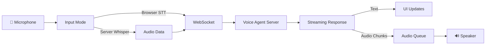

## Overview

The SDK includes a complete browser client implementation that demonstrates:
- WebSocket connection and message protocol
- Microphone capture with two input modes
- Transcript and audio data transmission
- Streaming audio chunk playback
- Barge-in / interruption handling
- Real-time UI updates

The reference implementation is at `example/voice-client.html` in the SDK repository.

## Architecture



## WebSocket Connection

### Establishing Connection

```javascript
let ws = null;
let connected = false;

function connect() {
  const endpoint = 'ws://localhost:8081/ws/voice';
  ws = new WebSocket(endpoint);
  
  ws.onopen = () => {
    console.log('Connected to server');
    connected = true;
    setStatus('Connected', 'connected');
  };
  
  ws.onclose = () => {
    console.log('Disconnected');
    connected = false;
    setStatus('Disconnected', 'disconnected');
    stopMic();
    stopAudioPlayback();
  };
  
  ws.onerror = (error) => {
    console.error('WebSocket error:', error);
  };
  
  ws.onmessage = (event) => {
    const msg = JSON.parse(event.data);
    handleServerMessage(msg);
  };
}

function disconnect() {
  stopMic();
  stopAudioPlayback();
  if (ws) {
    ws.close();
    ws = null;
  }
}
```

## Input Modes

The client supports two speech-to-text modes:

### 1. Browser Speech Recognition (Client-Side STT)

Uses the Web Speech API for real-time transcription:

```javascript
let recognition = null;
let micShouldRun = false;

const SpeechRecognition = 
  window.SpeechRecognition || window.webkitSpeechRecognition;

function initBrowserRecognition() {
  recognition = new SpeechRecognition();
  recognition.lang = 'en-US';
  recognition.interimResults = true;
  recognition.continuous = true;
  recognition.maxAlternatives = 1;
  
  recognition.onstart = () => {
    console.log('Browser STT started');
    setStatus('Listening (browser STT)...', 'listening');
  };
  
  recognition.onresult = (event) => {
    for (let i = event.resultIndex; i < event.results.length; i++) {
      const text = event.results[i][0].transcript.trim();
      if (!text) continue;
      
      if (event.results[i].isFinal) {
        // Auto barge-in on final transcript
        autoBargeIn();
        
        // Send to server
        if (ws && connected) {
          ws.send(JSON.stringify({ type: 'transcript', text }));
          console.log('Sent transcript:', text);
        }
      } else {
        // Show interim results
        displayTranscript(text + ' …');
        autoBargeIn(); // Interrupt as soon as speech detected
      }
    }
  };
  
  recognition.onerror = (event) => {
    console.error('Browser STT error:', event.error);
  };
  
  recognition.onend = () => {
    // Auto-restart if mic should stay on
    if (micShouldRun && connected) {
      setTimeout(() => {
        try { recognition.start(); } catch {}
      }, 250);
    }
  };
}

function startBrowserSTT() {
  if (!SpeechRecognition) {
    alert('Web Speech API not supported. Use Chrome/Edge.');
    return;
  }
  initBrowserRecognition();
  micShouldRun = true;
  recognition.start();
}

function stopBrowserSTT() {
  micShouldRun = false;
  if (recognition) recognition.stop();
}
```

<Note>
**Browser STT is only available in Chrome and Edge.** For other browsers, use Server Whisper mode.
</Note>

### 2. Server-Side Whisper (Audio Upload)

Captures raw audio and sends it to the server for transcription:

```javascript
let mediaStream = null;
let mediaRecorder = null;
let audioChunks = [];
let whisperListening = false;
let whisperSegmentActive = false;

// VAD (Voice Activity Detection) config
const VAD_SILENCE_TIMEOUT = 900;  // ms of silence before auto-send
const VAD_MIN_SEGMENT_MS = 700;   // ignore very short segments
let vadSilenceTimer = null;
let segmentStartTime = 0;

async function startWhisperListening() {
  try {
    mediaStream = await navigator.mediaDevices.getUserMedia({
      audio: {
        channelCount: 1,
        sampleRate: 16000,
        echoCancellation: true,
        noiseSuppression: true,
        autoGainControl: true
      }
    });
  } catch (err) {
    console.error('Mic permission error:', err);
    return;
  }
  
  whisperListening = true;
  setupAnalyser(mediaStream);
  startVADPolling();
  setStatus('Listening (Whisper VAD)...', 'listening');
}

function beginWhisperSegment() {
  if (!mediaStream || whisperSegmentActive) return;
  
  audioChunks = [];
  whisperSegmentActive = true;
  segmentStartTime = Date.now();
  
  // Choose best MIME type for Whisper
  const supportedTypes = [
    'audio/webm;codecs=opus',
    'audio/webm',
    'audio/ogg;codecs=opus'
  ];
  
  let mimeType = '';
  for (const type of supportedTypes) {
    if (MediaRecorder.isTypeSupported(type)) {
      mimeType = type;
      break;
    }
  }
  
  mediaRecorder = new MediaRecorder(mediaStream, {
    mimeType,
    audioBitsPerSecond: 128000
  });
  
  mediaRecorder.ondataavailable = (event) => {
    if (event.data.size > 0) audioChunks.push(event.data);
  };
  
  mediaRecorder.start(200);
  console.log('Speech detected — recording segment');
}

function finishWhisperSegment() {
  if (!whisperSegmentActive || !mediaRecorder) return;
  
  whisperSegmentActive = false;
  const duration = Date.now() - segmentStartTime;
  
  mediaRecorder.onstop = async () => {
    if (audioChunks.length === 0) return;
    
    // Ignore very short segments (clicks, pops)
    if (duration < VAD_MIN_SEGMENT_MS) {
      console.log(`Ignored short segment (${duration}ms)`);
      audioChunks = [];
      return;
    }
    
    try {
      const blob = new Blob(audioChunks, { type: mediaRecorder.mimeType });
      audioChunks = [];
      
      const arrayBuffer = await blob.arrayBuffer();
      const uint8 = new Uint8Array(arrayBuffer);
      
      // Base64 encode in chunks to avoid stack overflow
      let binary = '';
      const chunkSize = 8192;
      for (let i = 0; i < uint8.length; i += chunkSize) {
        const slice = uint8.subarray(i, Math.min(i + chunkSize, uint8.length));
        binary += String.fromCharCode.apply(null, slice);
      }
      const base64 = btoa(binary);
      
      if (ws && connected) {
        ws.send(JSON.stringify({
          type: 'audio',
          data: base64,
          format: mediaRecorder.mimeType,
          sampleRate: 16000,
          duration: duration
        }));
        console.log(`Sent audio segment: ${(uint8.length/1024).toFixed(1)}KB`);
      }
    } catch (err) {
      console.error('Error processing audio:', err);
    }
  };
  
  mediaRecorder.stop();
}
```

### Voice Activity Detection (VAD)

The Whisper mode includes VAD to automatically detect speech start/end:

```javascript
const VAD_BASE_THRESHOLD = 18;
const VAD_NOISE_MULTIPLIER = 2.2;
const VAD_SPEECH_START_FRAMES = 4;  // ~240ms before triggering

let analyserNode = null;
let vadSmoothedRms = 0;
let vadNoiseFloor = 10;
let vadSpeechFrames = 0;

function setupAnalyser(stream) {
  const ctx = new (window.AudioContext || window.webkitAudioContext)();
  const source = ctx.createMediaStreamSource(stream);
  analyserNode = ctx.createAnalyser();
  analyserNode.fftSize = 256;
  source.connect(analyserNode);
}

function getCurrentRMS() {
  if (!analyserNode) return 0;
  const data = new Uint8Array(analyserNode.frequencyBinCount);
  analyserNode.getByteFrequencyData(data);
  let sum = 0;
  for (let i = 0; i < data.length; i++) sum += data[i];
  return sum / data.length;
}

function vadCheck() {
  const rms = getCurrentRMS();
  vadSmoothedRms = vadSmoothedRms * 0.8 + rms * 0.2;
  
  if (!whisperSegmentActive) {
    vadNoiseFloor = vadNoiseFloor * 0.97 + vadSmoothedRms * 0.03;
  }
  
  const speechThreshold = Math.max(
    VAD_BASE_THRESHOLD,
    vadNoiseFloor * VAD_NOISE_MULTIPLIER
  );
  
  const isSpeech = vadSmoothedRms > speechThreshold;
  
  if (isSpeech && !whisperSegmentActive) {
    vadSpeechFrames += 1;
    if (vadSpeechFrames >= VAD_SPEECH_START_FRAMES) {
      autoBargeIn();  // Interrupt assistant
      beginWhisperSegment();
      vadSpeechFrames = 0;
    }
  } else if (!isSpeech && whisperSegmentActive && !vadSilenceTimer) {
    vadSilenceTimer = setTimeout(() => {
      finishWhisperSegment();
      vadSilenceTimer = null;
    }, VAD_SILENCE_TIMEOUT);
  } else if (isSpeech && vadSilenceTimer) {
    clearTimeout(vadSilenceTimer);
    vadSilenceTimer = null;
  }
}

function startVADPolling() {
  setInterval(vadCheck, 60); // Check every 60ms
}
```

## Sending Text Input

Users can also type messages:

```javascript
function sendTextMessage() {
  const text = textInput.value.trim();
  if (!text || !ws || !connected) return;
  
  autoBargeIn(); // Interrupt if assistant is speaking
  
  ws.send(JSON.stringify({ type: 'transcript', text }));
  console.log('Sent text:', text);
  
  textInput.value = '';
}

textInput.addEventListener('keydown', (e) => {
  if (e.key === 'Enter' && !e.shiftKey) {
    e.preventDefault();
    sendTextMessage();
  }
});
```

## Receiving Server Messages

Handle all message types from the server:

```javascript
function handleServerMessage(msg) {
  switch (msg.type) {
    // === Transcription ===
    case 'transcription_result':
      displayTranscript(msg.text);
      break;
    
    // === Text streaming ===
    case 'stream_start':
      clearAssistantText();
      break;
    
    case 'text_delta':
      appendAssistantText(msg.text);
      break;
    
    case 'stream_finish':
      console.log('Stream finished:', msg.finishReason);
      break;
    
    // === Tool calls ===
    case 'tool_call':
      displayToolCall(msg.toolName, msg.input);
      break;
    
    case 'tool_result':
      displayToolResult(msg.toolName, msg.result);
      break;
    
    // === Audio streaming ===
    case 'speech_stream_start':
      console.log('Speech stream started');
      break;
    
    case 'audio_chunk':
      const bytes = decodeBase64ToBytes(msg.data);
      audioQueue.push({ bytes, format: msg.format || 'mp3' });
      playNextAudioChunk();
      break;
    
    case 'speech_stream_end':
      console.log('Speech stream ended');
      break;
    
    // === Interruption ===
    case 'speech_interrupted':
      stopAudioPlayback();
      console.log('Speech interrupted:', msg.reason);
      break;
    
    // === Response complete ===
    case 'response_complete':
      console.log('Response complete');
      break;
  }
}
```

## Audio Playback

### Queueing and Playing Chunks

```javascript
let audioContext = null;
let audioQueue = [];
let isPlaying = false;
let currentAudioSource = null;

function getAudioContext() {
  if (!audioContext) {
    audioContext = new (window.AudioContext || window.webkitAudioContext)();
  }
  if (audioContext.state === 'suspended') {
    audioContext.resume();
  }
  return audioContext;
}

async function playNextAudioChunk() {
  if (isPlaying || audioQueue.length === 0) return;
  
  isPlaying = true;
  const { bytes, format } = audioQueue.shift();
  
  try {
    const ctx = getAudioContext();
    const arrayBuffer = bytes.buffer.slice(
      bytes.byteOffset,
      bytes.byteOffset + bytes.byteLength
    );
    
    try {
      // Try WebAudio API first
      const audioBuffer = await ctx.decodeAudioData(arrayBuffer.slice(0));
      
      await new Promise((resolve) => {
        const source = ctx.createBufferSource();
        source.buffer = audioBuffer;
        source.connect(ctx.destination);
        currentAudioSource = source;
        source.onended = resolve;
        source.start(0);
      });
      currentAudioSource = null;
    } catch (decodeErr) {
      // Fallback to Audio element
      console.warn('WebAudio decode failed, using Audio element');
      const mime = getMimeTypeForFormat(format);
      const blob = new Blob([bytes], { type: mime });
      const url = URL.createObjectURL(blob);
      const audio = new Audio(url);
      
      await audio.play();
      await new Promise((resolve) => {
        audio.onended = resolve;
        audio.onerror = resolve;
      });
      URL.revokeObjectURL(url);
    }
  } catch (err) {
    console.error('Audio playback error:', err);
  } finally {
    isPlaying = false;
    if (audioQueue.length > 0) {
      playNextAudioChunk(); // Continue with next chunk
    }
  }
}

function stopAudioPlayback() {
  if (currentAudioSource) {
    try { currentAudioSource.stop(); } catch {}
    currentAudioSource = null;
  }
  audioQueue = [];
  isPlaying = false;
}

function decodeBase64ToBytes(base64) {
  const binary = atob(base64);
  const len = binary.length;
  const bytes = new Uint8Array(len);
  for (let i = 0; i < len; i++) {
    bytes[i] = binary.charCodeAt(i);
  }
  return bytes;
}

function getMimeTypeForFormat(format) {
  switch ((format || '').toLowerCase()) {
    case 'opus': return 'audio/ogg; codecs=opus';
    case 'ogg': return 'audio/ogg';
    case 'wav': return 'audio/wav';
    case 'mp3': return 'audio/mpeg';
    case 'aac': return 'audio/aac';
    case 'webm': return 'audio/webm';
    default: return 'audio/mpeg';
  }
}
```

## Barge-In / Auto-Interruption

Automatically interrupt the assistant when the user starts speaking:

```javascript
function autoBargeIn() {
  if (!isAssistantSpeaking()) return;
  
  stopAudioPlayback();
  
  if (ws && connected) {
    ws.send(JSON.stringify({
      type: 'interrupt',
      reason: 'user_speaking'
    }));
    console.log('Auto-interrupt: user started speaking');
  }
}

function isAssistantSpeaking() {
  return isPlaying || audioQueue.length > 0;
}
```

<Note>
Barge-in is triggered automatically in both STT modes when the user starts speaking, providing a natural conversation flow.
</Note>

## Complete HTML Example

Here's a minimal complete example:

```html
<!DOCTYPE html>
<html lang="en">
<head>
  <meta charset="UTF-8">
  <title>Voice Agent Client</title>
</head>
<body>
  <h1>Voice Agent Client</h1>
  
  <div>
    <input type="text" id="endpoint" value="ws://localhost:8081/ws/voice" />
    <button id="connectBtn">Connect</button>
    <button id="disconnectBtn" disabled>Disconnect</button>
  </div>
  
  <div>
    <button id="startMicBtn" disabled>Start Mic</button>
    <button id="stopMicBtn" disabled>Stop Mic</button>
    <button id="interruptBtn" disabled>Interrupt</button>
  </div>
  
  <div>
    <h3>You said:</h3>
    <div id="transcript">—</div>
  </div>
  
  <div>
    <h3>Assistant:</h3>
    <div id="assistant"></div>
  </div>
  
  <script>
    // Use the connection, input, and playback code from above
    document.getElementById('connectBtn').addEventListener('click', connect);
    document.getElementById('disconnectBtn').addEventListener('click', disconnect);
    document.getElementById('startMicBtn').addEventListener('click', startBrowserSTT);
    document.getElementById('stopMicBtn').addEventListener('click', stopBrowserSTT);
    document.getElementById('interruptBtn').addEventListener('click', () => {
      stopAudioPlayback();
      ws.send(JSON.stringify({ type: 'interrupt', reason: 'user_clicked' }));
    });
  </script>
</body>
</html>
```

## Best Practices

<AccordionGroup>
  <Accordion title="Handle connection loss gracefully">
    Always clean up resources (stop mic, clear audio queue) when the WebSocket disconnects.
  </Accordion>
  
  <Accordion title="Use HTTPS in production">
    Microphone access requires a secure context (HTTPS) except on localhost.
  </Accordion>
  
  <Accordion title="Provide visual feedback">
    Show connection status, listening state, and speaking state clearly in the UI.
  </Accordion>
  
  <Accordion title="Test on target browsers">
    Browser STT only works in Chrome/Edge. Provide Whisper mode as a fallback.
  </Accordion>
  
  <Accordion title="Tune VAD for your environment">
    Adjust VAD thresholds based on typical background noise levels.
  </Accordion>
</AccordionGroup>

## Next Steps

<CardGroup cols={2}>
  <Card title="Interruption Handling" icon="hand" href="/guides/interruption-handling">
    Deep dive into barge-in and interruption mechanisms
  </Card>
  <Card title="History Management" icon="clock-rotate-left" href="/guides/history-management">
    Manage conversation state and persistence
  </Card>
</CardGroup>
